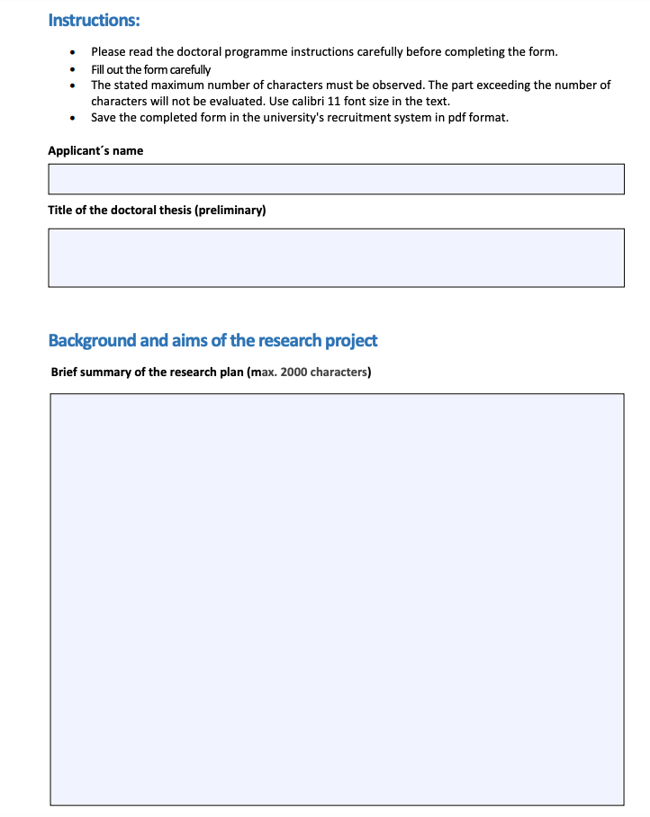

# Applying salaried PhD researcher positions at the University of Helsinki

Once a year, the doctoral programmes of the University of Helsinki open a call for applications for university-funded doctoral candidate positions. The doctoral candidates selected for these positions complete their doctoral research employed by the university. Both current University of Helsinki doctoral candidates and new applicants planning on doctoral studies are eligible to apply for these positions.

I was lucky enough to get one of these positions in the Doctoral Programme in Political, Societal, and Regional Changes (henceforth: PSRC) at the University of Helsinki in 2022. Since many PhD candidates are looking for funding for their current and/or future PhD research, I decided to share my own experiences of applying (successfully) to a salaried doctoral researcher at the University of Helsinki.

This post includes the most relevant points on:

-   Application form
-   Research plan (things to consider when writing it)

# Application form

The first thing that might confuse applying these positions is the application form. You can find the form and general instructions on how to apply for the position on the doctoral programme's website. After opening the general instructions site, navigate to the section "**Application form**" and click on "[Research plan](https://www.helsinki.fi/assets/drupal/2022-09/Research_plan.pdf)". After that, a site with the following views opens:

As you may see, there is very limited space for writing different sections. Also, the character limitations may seem illogical at many points: for example, the motivation section for conducting doctoral research is as long as the research summary, rationale for the research project, and objectives of your research. Why so? I guess that since the application form is similar to ***all doctoral programmes at the University of Helsinki*** (whether you’re a social scientist, humanist, natural scientist, or medical student), the university does not want to change the application format too often. Moreover, this application form may fit better and/or be more typical to some branches of science than to others.

Since the application form is so short and some sections seem a bit repetitive – i.e. it almost seems that you’re asked to write the same things twice – my strategy in writing this application was to repeat as little as possible the same ideas between the sections. I know, sometimes it’s necessary to repeat the same ideas briefly, but if you have to do, my advice is to try to do it as shortly as possible. This way you have maximum space to represent your ideas.

# Style of your application text: as simple as possible, while keeping it interesting to the maximum amount of people

The second piece of advice related to writing the research plan is the style. My supervisors advised me to write the text as simply as possible; you’re likely a better specialist in your area than most of the evaluators reading your text. This is especially true in multidisciplinary doctoral programmes, where there is a wide range of disciplines. For example, my own doctoral programme (PSRC), the programme consists of the following branches of science: area and cultural studies, consumer economics, global development studies, economic and social history, human geography, political history, and political science. Thus, you can’t expect that evaluators from, say, Nordic studies are familiar with quantitative political science, and the other way around. Therefore, try to write your research plan in a way that is easily understandable also for a non-specialist in your research area. You may clarify details later in the interview situation, in case you’re shortlisted.

Another point worth mentioning related to multidisciplinary doctoral programmes is that while your research plan should be as easily understandable as possible, it should be also as ***universally interesting as possible*** (I know, is not so easy!). For example, since my research idea was to study how political participation relates to authoritarianism in Russia and/or the post-Soviet sphere, I tried to emphasize – at least between the lines – how the research on rise of authoritarian politics is not relevant and interesting only to Russian and Eurasian studies, but to other disciplines as well (e.g. to political science, development studies, political history, and so on). I also thought a lot about how to argue why Russia is an exactly relevant case study. Here, my rationale was that Russia is a good case study because 1) it represents a modern autocracy, 2) there is a lot of good quality data for my research, and 3) the overall economic and human development (e.g. high education levels and socio-economic development) in Russia are at odds with the political development of the country (low levels of political participation and growing authoritarianism).

The final point and advice that I got from supervisors were ***to be bold*** when writing the plan. At this stage, you don’t have to have ready research results, and it’s okay to make some assumptions about the outcomes of your research and how your research will contribute to and complete the existing research on the topic.

## Research data, methods, ethics, study plans…

Lastly, one thing that can be puzzling in writing your research plan is what to say about the research data, methods, ethics, study plans, and similar things that you’re not sure about yet. For example, you probably have some idea of what kind of data and methods you could apply in your research, but you’re still unsure whether you’ll use exactly these data and methods or not. My advice is not to worry about these too much: you need to have some idea where the data and which methods to use, but, at the same, it’s completely normal not to be 100% sure about these things yet. At this point, it’s more important that you demonstrate that your research is doable and that you have considered these things.

The same logic applies to other things in your research plan, like research ethics and study plan: the most important thing at this stage is that you’ve thought about these things. Nobody expects an early-stage or soon-to-be PhD researcher to be an expert on research ethics, and study plans can change too. Thus, my advice is to concentrate your energy and focus on more substantive issues of your research plan, like rationale, objectives, and scientific impacts of the research.

# Final thoughts

As a disclaimer, I should mention that the ideas presented here were my thoughts and strategies when applying for the salaried PhD researcher position at the University of Helsinki. Some advice may work better for you and in applying to certain doctoral programmes, and some not.

I hope you find these tips interesting and relevant to you. The relevant parts of my research application can be downloaded by clicking the **“PDF”**-button under the main title of this blog post. While your own research plan and idea is differs from mine, you may draw some ideas from there.

Finally, I wish you good luck in applying, and hope to see you as my future colleagues!

